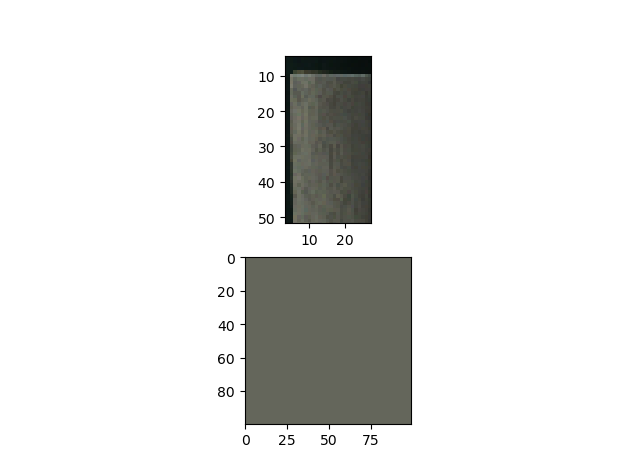
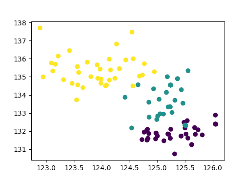
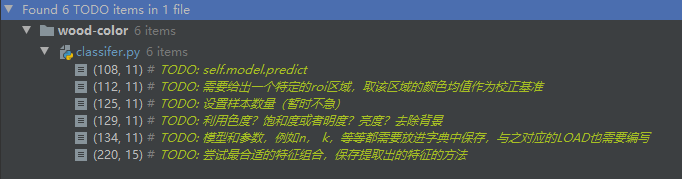
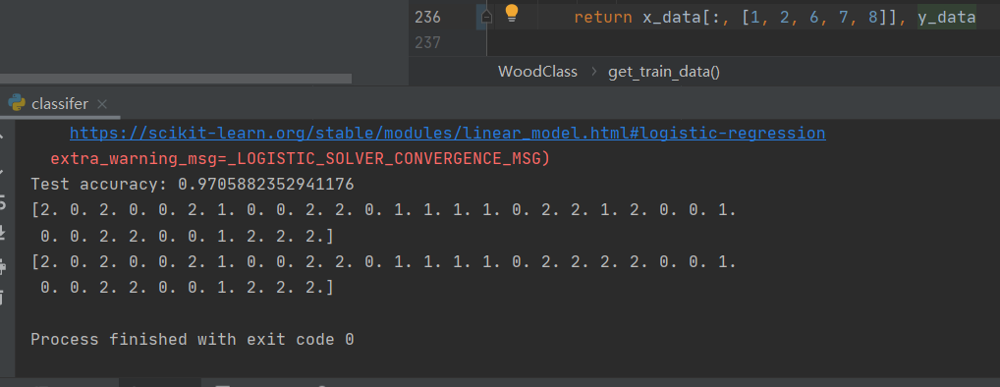

# 木地板分色识别项目

## 训练数据准备

请在使用前在同一文件夹下创建data文件夹，所需的文件目录如下：

```bash
.
├── README.md
├── classifer.py
├── data
│   ├── dark
│   ├── light
│   └── middle
```

上上面所示的三个文件夹下分别放置三种不同色彩的木板图片就可以训练了。

当然不要放除了图片外的东西，不然程序会出错哦。

## 色彩提取

下图为色彩提取效果：



我们利用概率的方法以随机对抗随机，然后使用二项分布的概率分位点即可获得任意纯度下的木板色彩。

但是纯度过高有时反而会难以反映木板的颜色，所以关于纯度的取舍还需调整。目前的纯度要求0.99999下，该木板的分类效果好像可以有较好的表现，反正之后再调整嘛~

## 色彩分布

我们可以明显发现，在进行了色彩提纯后，色彩的区分度在lab空间下的ab平面还是很具备可分性的，所以直接用logistic regression这样的线性方法就够了。



在classifer中还有6处简单的TODO, 交给老孙完成了，加油！




最终通过选择多次特征的组合，找到了效果比较好的特征 1 2 6 7 8 或 1 2 6 7 

在数据集上的测试准确率为： 97.05%



